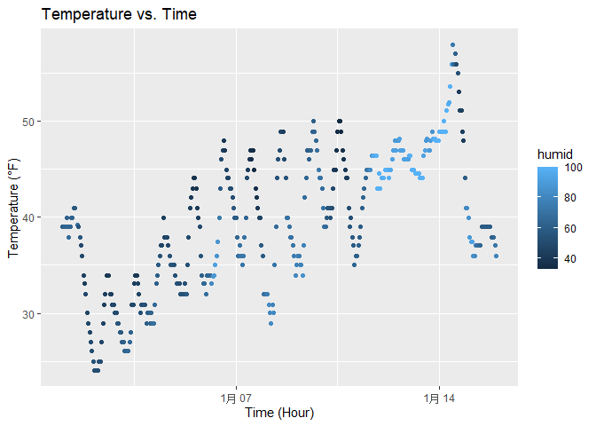

P8105_hw1_wl3013
================
Wen Li (wl3013)
2025-09-13

# Problem 1

- View variables in this dataset & check the values of important
  variable

``` r
names(early_january_weather)
```

    ##  [1] "origin"     "year"       "month"      "day"        "hour"      
    ##  [6] "temp"       "dewp"       "humid"      "wind_dir"   "wind_speed"
    ## [11] "wind_gust"  "precip"     "pressure"   "visib"      "time_hour"

``` r
summary(early_january_weather)
```

    ##     origin               year          month        day              hour      
    ##  Length:358         Min.   :2013   Min.   :1   Min.   : 1.000   Min.   : 0.00  
    ##  Class :character   1st Qu.:2013   1st Qu.:1   1st Qu.: 4.000   1st Qu.: 6.00  
    ##  Mode  :character   Median :2013   Median :1   Median : 8.000   Median :11.50  
    ##                     Mean   :2013   Mean   :1   Mean   : 8.039   Mean   :11.53  
    ##                     3rd Qu.:2013   3rd Qu.:1   3rd Qu.:12.000   3rd Qu.:17.75  
    ##                     Max.   :2013   Max.   :1   Max.   :15.000   Max.   :23.00  
    ##                                                                                
    ##       temp            dewp           humid           wind_dir    
    ##  Min.   :24.08   Min.   : 8.96   Min.   : 32.86   Min.   :  0.0  
    ##  1st Qu.:33.98   1st Qu.:19.94   1st Qu.: 51.34   1st Qu.:140.0  
    ##  Median :39.02   Median :26.06   Median : 61.67   Median :240.0  
    ##  Mean   :39.58   Mean   :28.06   Mean   : 65.48   Mean   :208.2  
    ##  3rd Qu.:44.96   3rd Qu.:35.06   3rd Qu.: 78.68   3rd Qu.:290.0  
    ##  Max.   :57.92   Max.   :53.06   Max.   :100.00   Max.   :360.0  
    ##                                                   NA's   :5      
    ##    wind_speed       wind_gust         precip            pressure   
    ##  Min.   : 0.000   Min.   :16.11   Min.   :0.000000   Min.   :1011  
    ##  1st Qu.: 5.754   1st Qu.:19.56   1st Qu.:0.000000   1st Qu.:1018  
    ##  Median : 8.055   Median :21.86   Median :0.000000   Median :1022  
    ##  Mean   : 8.226   Mean   :22.53   Mean   :0.002039   Mean   :1023  
    ##  3rd Qu.:11.508   3rd Qu.:25.32   3rd Qu.:0.000000   3rd Qu.:1027  
    ##  Max.   :24.166   Max.   :31.07   Max.   :0.190000   Max.   :1034  
    ##                   NA's   :308                        NA's   :38    
    ##      visib          time_hour                  
    ##  Min.   : 0.120   Min.   :2013-01-01 01:00:00  
    ##  1st Qu.: 9.000   1st Qu.:2013-01-04 19:15:00  
    ##  Median :10.000   Median :2013-01-08 12:30:00  
    ##  Mean   : 8.515   Mean   :2013-01-08 12:28:09  
    ##  3rd Qu.:10.000   3rd Qu.:2013-01-12 05:45:00  
    ##  Max.   :10.000   Max.   :2013-01-15 23:00:00  
    ## 

- Show the size of the dataset, including the number of row and column.

``` r
nrow(early_january_weather)
```

    ## [1] 358

``` r
ncol(early_january_weather)
```

    ## [1] 15

Row = 358, column = 15.

- Calculate the mean of temperature

``` r
mean(early_january_weather$temp)
```

    ## [1] 39.58212

Summary: This dataset has 358 rows and 15 columns. The variables inclue
“origin”, “year”, “month”, “day”, “hour”, “temp”, “dewp”, “humid”,
“wind_dir”, “wind_speed”, “wind_gust”, “precip”, “pressure”, “visib”,
“time_hour”. The mean of temperature is 39.58 °F.

- Creat the scatterplot & Save it

``` r
ggplot(early_january_weather, aes(x = time_hour, y = temp, color = humid) ) + 
  geom_point() + 
  labs(
    title = "Temperature vs. Time",
    x = "Time (Hour)",
    y = "Temperature (°F)"
  )
```

<!-- -->

``` r
ggsave("Scatter_temp_time.png", width = 7, height = 5)
```

# Problem 2

\*Create a data frame contains: A random sample of size 10 from standard
Normal distribution Logical vector indicating whether elements of the
sample are greater than 0 Character vector of length 10 Factor vector of
length 10, with 3 different factor “level”

``` r
set.seed(123)

Q2_df = tibble(
  vec_numeric = rnorm(10),
  vec_logical = rnorm(10)>0,
  vec_char = sample(letters,10),
  vec_factor = factor(sample(c("Yes","No","Unknown"),10, replace = T))
  
)
```

\*Try to take the mean of each variable

``` r
mean(Q2_df %>% pull(vec_numeric))
```

    ## [1] 0.07462564

``` r
mean(Q2_df %>% pull(vec_logical))
```

    ## [1] 0.7

``` r
mean(Q2_df %>% pull(vec_char))
```

    ## Warning in mean.default(Q2_df %>% pull(vec_char)): argument is not numeric or
    ## logical: returning NA

    ## [1] NA

``` r
mean(Q2_df %>% pull(vec_factor))
```

    ## Warning in mean.default(Q2_df %>% pull(vec_factor)): argument is not numeric or
    ## logical: returning NA

    ## [1] NA

Summary: Taking mean only work for variable of numeric and logical, the
other two, character vector and factor vector can’t be calculate the
mean.
